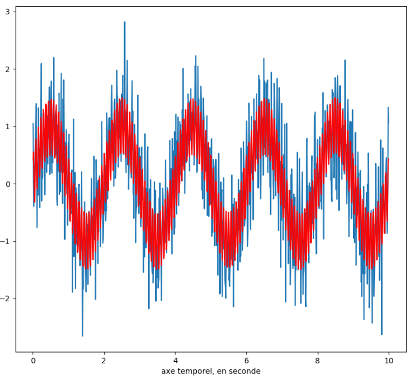
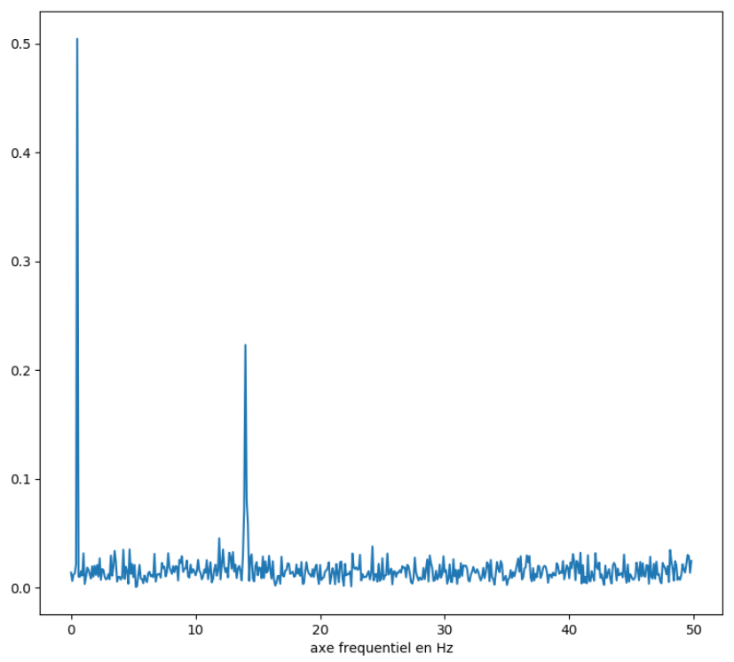

# Spectrogrammes de signaux audio  (chapitre 10.2)

<!-- Avant de commencer. Consulter les instructions à suivre dans [instructions.md](instructions.md) -->

Nous allons reprendre l'exemple du chapitre 10.1, mais en générant et en affichant le spectre de fréquence à l'aide de scipy et de matplotlib.

## Transformée de Fourier d'un signal
### `utils.fft.apply_fft()`

Une transformée de Fourier est une transformée mathématique qui décompose une fonction (ou un signal) en ses composantes fréquentielles. On passe donc du domaine temporel (amplitude en fonction du temps) au domaine fréquentiel (magnitude en fonction de la fréquence).

Le module [`scipy.fft`](https://docs.scipy.org/doc/scipy/reference/tutorial/fft.html) nous permet d'appliquer une telle transformée sur un signal en traitant l'opération comme une boîte noire : on doit seulement savoir ce qui entre et ce qui sort. On utilise la fonction [`scipy.fft.fft`](https://docs.scipy.org/doc/scipy/reference/generated/scipy.fft.fft.html#scipy.fft.fft) pour faire des [transformées discrètes 1D](https://docs.scipy.org/doc/scipy/reference/tutorial/fft.html#d-discrete-fourier-transforms). Pour créer l'axe fréquentielle, vous pouvez utiliser les mêmes fonctions que pour créer l'axe temporel des signaux, c'est à dire soit en utilisant [`numpy.arange()`](https://numpy.org/doc/stable/reference/generated/numpy.arange.html) ou [`numpy.linspace()`](https://numpy.org/doc/stable/reference/generated/numpy.linspace.html#numpy.linspace).

## Affichage du spectre

Une fois la FFT appliquée, on a notre axe de magnitude et notre axe fréquentiel, on est donc prêts à dessiner sur un graphique. Sans trop compliquer les choses, on peut utiliser facilement [`matplotlib.pyplot`](https://matplotlib.org/tutorials/introductory/pyplot.html) et le faire en quelques lignes. On fait quelques exemples dans `main()`

## Spectrogramme d'un signal par tranche
### `utils.fft.spectrogram()`

On peut appliquer la FFT par tranche sur un signal pour obtenir le portrait du spectre d'un signal selon le temps. Par exemple, les visualiseurs audio font souvent ça pour montrer la FFT en temps réel. On va donc découper notre signal en tranches de tailles égales et appliquer la FFT sur chacune d'elles. Toutefois, plutôt que d'avoir un tableau des FFT de toutes les tranches (couteux), on va en faire un générateur.

## Animation d'un spectrogramme
### `build_spectrogram_animation()`

Nous allons maintenant faire un visualeur de FFT en temps réel qui affiche le spectre par tranche mais avec le même minutage que le signal original. C'est ici une utilisation plus avancée de `matplotlib`, la majorité du travail est donc faite pour vous.

Vous devez vous servir des fonctions précédemment écrite en plus de celles présentes dans les autres fichiers sources (comme `load_wav()`, `normalize()`, `mix_signals()`, etc.)

Références pour les TODO:
    [Échelle des axes](https://matplotlib.org/api/axes_api.html#axis-scales),
    [Limites et direction des axes](https://matplotlib.org/api/axes_api.html#axis-limits-and-direction).

## Jouer le son

Cette partie est faite pour vous, mais c'est juste une utilisation de la librairie [playsound](https://pypi.org/project/playsound/) pour partir la lecture, en une ligne, sans autre contrôle. On part toutefois la lecture en parallèle (quoique pas vraiment car on utilise `threading`) pour laisser le temps au graphique de se charger de façon à synchroniser le graphique et la lecture de la musique.

`pip install playsound` pour installer.
